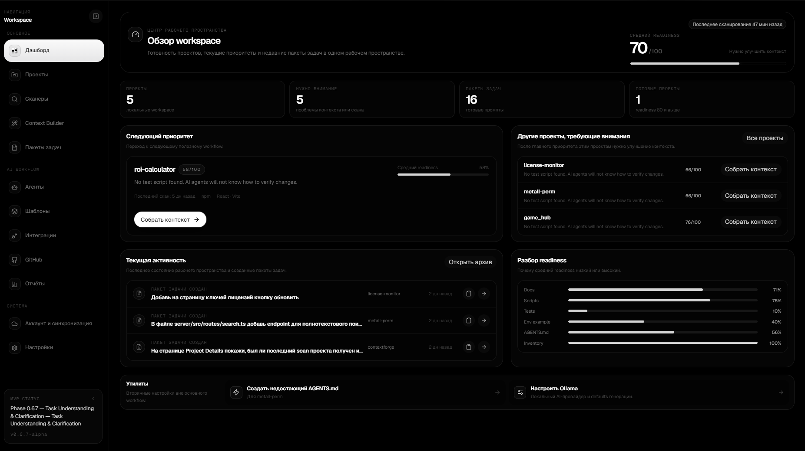
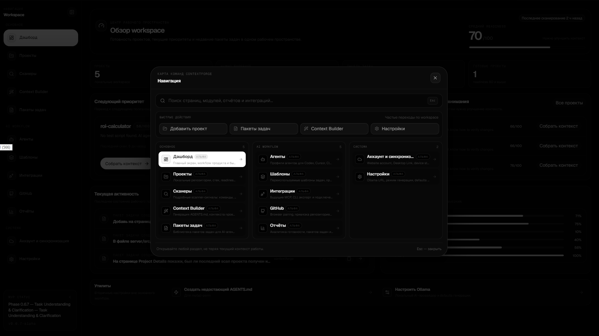
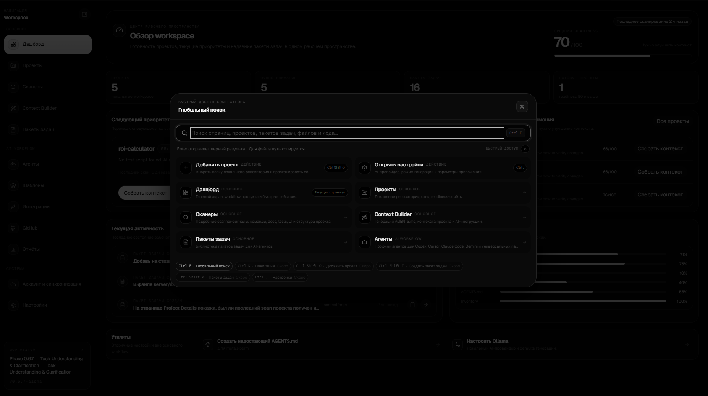

# ContextForge

[](https://github.com/drag1web/contextforge/actions/workflows/ci.yml)


**ContextForge** is a local-first desktop workspace for preparing software projects for AI coding agents.

It scans a repository, explains project readiness, builds reusable project context, generates editable `AGENTS.md` files, and creates guarded Task Packs for **Codex**, **Cursor**, **Claude Code**, **Gemini**, and generic coding agents. ContextForge also includes a local stdio **MCP server** for safe project and Task Pack access from compatible clients.

> Current release: **v0.7.0-alpha — Desktop Workspace & Local MCP**<br>
> This is a source pre-release. A packaged installer is intentionally not included yet.

<p align="center">
  
</p>

## Why ContextForge

- **Local-first by default.** Project scanning, SQLite storage, context selection, Task Packs, and MCP run on the local machine.
- **Explainable context.** Selected files have roles, reasons, confidence, quality signals, and review states instead of opaque file dumps.
- **Guarded AI workflow.** Missing values, subjective scope, unsafe targets, and weak ownership evidence stay in clarification, review, or investigation flows.
- **Reusable outputs.** Project Memory, templates, rule profiles, acceptance criteria, `AGENTS.md`, and Task Packs survive restarts and can be reused across tools.

## Current capabilities

### Project workspace

- Add and rescan local repositories.
- Detect stack, package manager, scripts, tests, documentation, CI, configuration, and inventory signals.
- Show AI readiness, project details, scanner evidence, local Git state, and lightweight diff review.
- Maintain project-specific memory and decisions without uploading source code.

### Task Packs

- Understand informal RU/EN/mixed-language tasks before file selection.
- Ask focused clarification questions when required information is missing.
- Select grounded implementation and supporting context from real repository evidence.
- Apply templates, rule profiles, custom rules, and acceptance criteria.
- Generate, edit, save, copy, and export Task Packs as Markdown or text.
- Show privacy-safe selector, generation, and performance diagnostics.

### Integrations

- Optional Ollama and supported AI-provider refinement with validated fallback.
- Optional GitHub device authentication, repository linking, Issue → Task Pack, and Task Pack → Issue workflows.
- Optional website account and explicit Task Pack handoff through Desktop Link.
- Local ContextForge MCP server for Codex and other MCP-compatible clients.

## Local MCP

ContextForge MCP uses stdio and the same local storage and guarded Task Pack pipeline as the desktop backend.

Read operations are enabled with the server. Task Pack creation is disabled by default and requires both:

1. an explicit local permission;
2. `confirmCreate: true` on the individual tool call.

The MCP server does **not** edit repository files, run shell commands, mutate Git, or launch coding-agent tasks.

Main commands:

```bash
npm run build
npm run mcp:start
npm run test:mcp
```

Setup, permissions, tools, resources, prompts, Codex registration, and troubleshooting are documented in [`docs/mcp.md`](docs/mcp.md).

<table>
  <tr>
    <td width="50%"></td>
    <td width="50%"></td>
  </tr>
</table>

## Privacy and safety boundary

ContextForge is designed to keep source code local unless the user starts an explicit external workflow.

- SQLite is the default desktop storage.
- Absolute local project roots are omitted from exported Task Pack metadata.
- Diagnostics do not store raw prompts, model responses, source snippets, secrets, or absolute paths.
- GitHub workflows send repository and issue metadata only when explicitly requested.
- Website publication transfers only the selected Task Pack and rejects detected secrets and absolute local paths.
- MCP list operations omit full Task Pack prompts and redact secret-like values.

## Run from source

### Requirements

- Node.js 20+
- npm
- Optional: Ollama for local AI refinement
- Optional: Docker only for PostgreSQL adapter experiments

### Install and start

```bash
npm install
npm run dev
```

Development mode starts:

- Express API on `http://localhost:4000`;
- Vite renderer on `http://localhost:5173`;
- Electron desktop shell.

Normal desktop development uses local SQLite and does not require Docker.

### Build

```bash
npm run build
```

### Focused validation

```bash
npm run test:mcp
npm run test:desktop-sync
npm run test:understanding
npm run test:clarification
npm run test:generation:taskpack
npm run test:selector:rollout
npm run test:ownership
npm run test:canonical-core
npm run test:context-quality
```

Additional selector, safety, grounding, benchmark, and Validation Lab commands are available in `package.json`.

## Environment

Copy `.env.example` to `.env` and adjust only the integrations you need.

```env
STORAGE_DRIVER=sqlite
SQLITE_DB_PATH=./data/contextforge.sqlite
SERVER_PORT=4000
OLLAMA_URL=http://localhost:11434
APP_VERSION=0.7.0-alpha

CONTEXTFORGE_MCP_ENABLED=true
CONTEXTFORGE_MCP_ALLOW_CREATE_TASK_PACKS=false
```

GitHub, website account, PostgreSQL, and external AI providers are optional.

## Architecture

```text
Electron desktop shell
  ├─ React + TypeScript + Vite renderer
  ├─ Local Express API
  │    ├─ scanner and readiness
  │    ├─ Task Understanding and clarification
  │    ├─ selector / ownership / authorization pipeline
  │    ├─ Context Composer and Task Pack generation
  │    ├─ Git and GitHub workflow services
  │    └─ SQLite-first StorageAdapter
  └─ Local MCP stdio server
       ├─ read-only project, memory, and Task Pack access
       └─ explicitly authorized Task Pack creation
```

## Documentation

- [`docs/mcp.md`](docs/mcp.md) — local MCP server and Codex setup.
- [`docs/MVP.md`](docs/MVP.md) — current alpha product boundary and release checklist.
- [`docs/ROADMAP.md`](docs/ROADMAP.md) — completed milestones and next product phases.
- [`docs/VALIDATION_LAB.md`](docs/VALIDATION_LAB.md) — portable sequential validation workflow.
- [`docs/SELECTOR_BENCHMARK.md`](docs/SELECTOR_BENCHMARK.md) — selector benchmark model and private-manifest boundary.
- [`CHANGELOG.md`](CHANGELOG.md) — detailed release history.

## Release status

`v0.7.0-alpha` is a GitHub source pre-release. It marks the completion of the large desktop UI refresh, the current universal grounding baseline, Desktop Link improvements, and ContextForge MCP Server v1.

Known release boundaries:

- no installer or portable binary yet;
- deep selector support remains strongest for TypeScript/JavaScript projects;
- MCP v1 is local stdio only;
- remote MCP, automatic code changes, automatic PRs, and agent task orchestration are not part of this release.

See [`docs/releases/v0.7.0-alpha.md`](docs/releases/v0.7.0-alpha.md) for the release summary.
