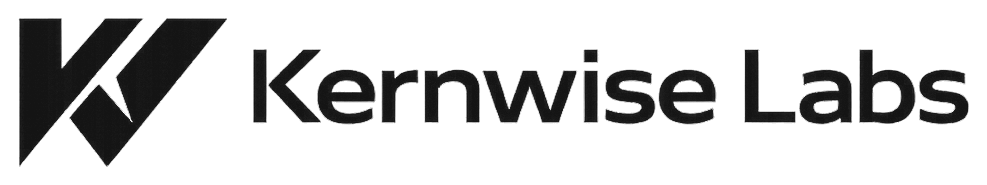
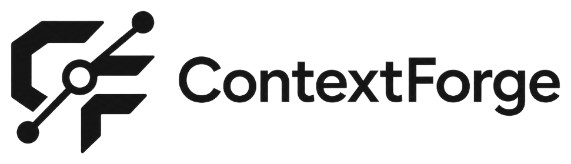
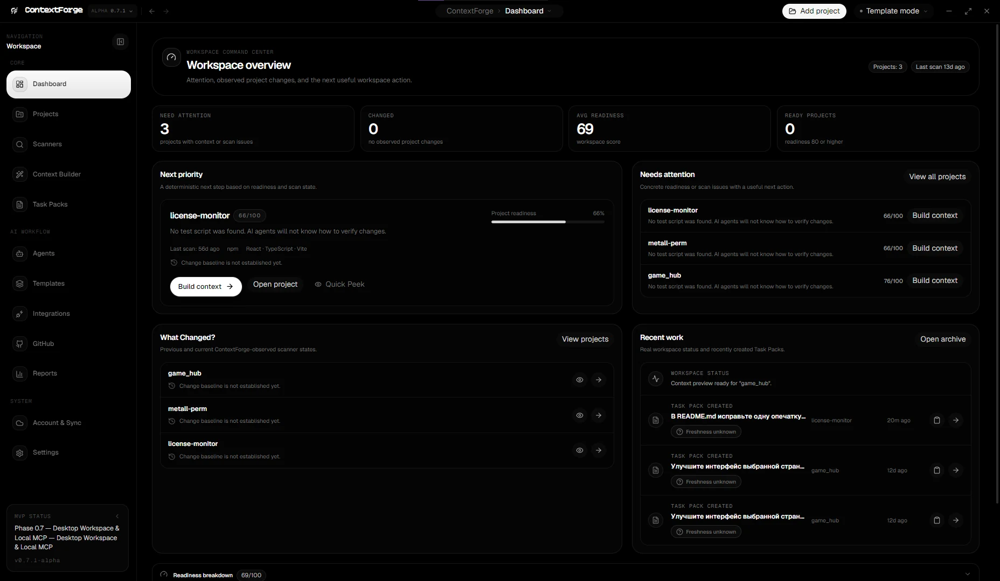
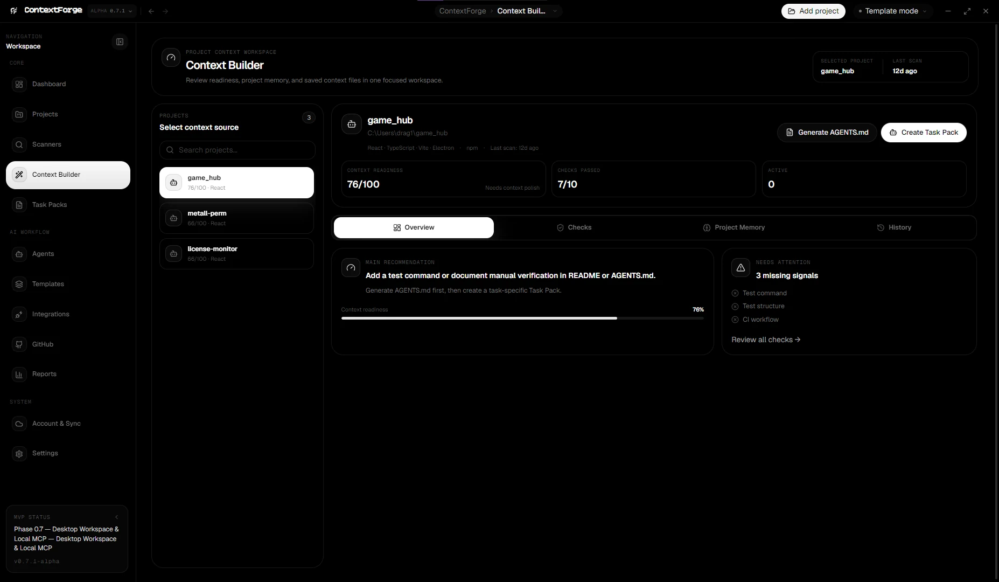
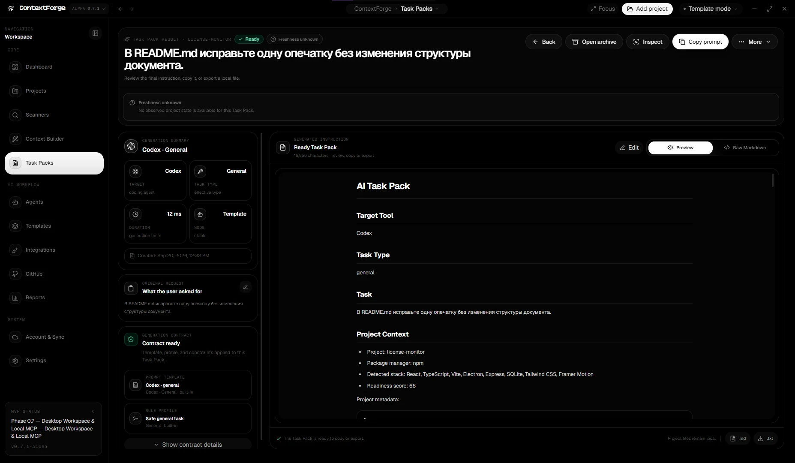
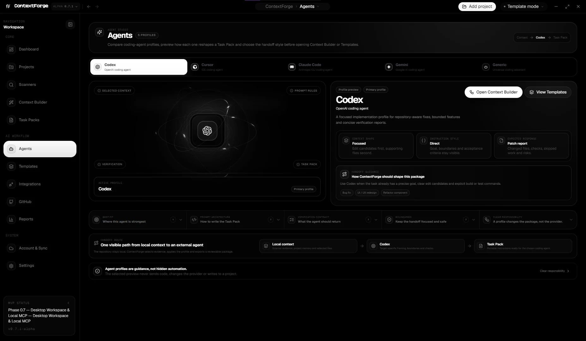
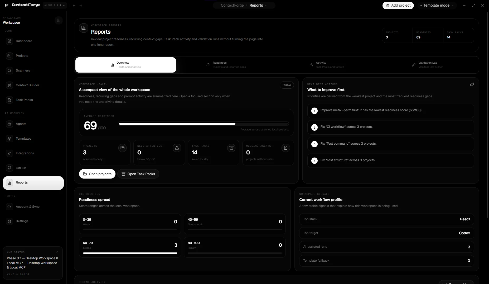

<div align="center">

<picture>
  <source media="(prefers-color-scheme: dark)" srcset="docs/assets/brand/kernwise-labs-white.png">
  <source media="(prefers-color-scheme: light)" srcset="docs/assets/brand/kernwise-labs-dark.png">
  
</picture>

<br/>

<sub><strong>A Kernwise Labs project</strong></sub>

<br/><br/>

<picture>
  <source media="(prefers-color-scheme: dark)" srcset="docs/assets/brand/contextforge-logo-white.png">
  <source media="(prefers-color-scheme: light)" srcset="docs/assets/brand/contextforge-logo-dark.png">
  
</picture>

### Grounded project context for AI coding agents.

**Understand the repository. Ground the task in real evidence. Hand off a reviewable Task Pack.**

ContextForge is a local-first desktop workspace that understands your repository, selects real project evidence, and turns tasks into reviewable Task Packs for Codex, Cursor, Claude Code, Gemini, and other coding agents.

[](https://github.com/drag1web/contextforge/actions/workflows/ci.yml)


[Product tour](#product-tour) · [Capabilities](#current-capabilities) · [Local MCP](#local-mcp) · [Architecture](#architecture) · [Roadmap](#project-status)

</div>

<p align="center">
  
</p>

<p align="center">
  <sub>One local workspace for project readiness, grounded context, Task Packs, and agent handoff.</sub>
</p>

## What ContextForge does

<table>
  <tr>
    <td width="33%" valign="top">
      <h3>Understand</h3>
      Scan a real repository, detect stack and project signals, assess AI readiness, and understand the task before choosing files.
    </td>
    <td width="33%" valign="top">
      <h3>Ground</h3>
      Select implementation context from real repository evidence instead of inventing files, owners, APIs, or architecture.
    </td>
    <td width="33%" valign="top">
      <h3>Deliver</h3>
      Build a reviewable Task Pack shaped for the target coding agent, with rules, constraints, context, and verification guidance.
    </td>
  </tr>
</table>

```text
Repository → Task Understanding → Grounded Context → Review → Task Pack → Coding Agent
```

ContextForge is designed around one idea: **better coding-agent results start with better context, not bigger prompts.**

## Product tour

### 1. Build grounded project context

<p align="center">
  
</p>

Review project readiness, checks, memory, and real repository context before generation.

### 2. Turn the task into a reviewable Task Pack

<p align="center">
  
</p>

Generate a portable instruction package with the selected context, constraints, agent profile, and verification guidance.

### 3. Shape the handoff for the coding agent

<p align="center">
  
</p>

Agent profiles change how a Task Pack is framed — context shape, instruction style, verification expectations, and boundaries — without silently running an agent or writing to the repository.

### 4. See the whole workspace

<p align="center">
  
</p>

Reports summarize project readiness, recurring gaps, Task Pack activity, and the next useful actions across the local workspace.

## Why ContextForge

- **Local-first by default.** Repository scanning, SQLite storage, context selection, Task Packs, and MCP run locally.
- **Grounded instead of guessed.** Context is selected from real inventory paths and repository evidence.
- **Explainable selection.** Files carry roles, reasons, confidence/evidence signals, review state, and diagnostics.
- **Guarded workflows.** Missing values, weak ownership evidence, unsafe targets, and ambiguous scope can stay in clarification, review, or investigation flows.
- **Reusable project knowledge.** Project Memory, templates, rule profiles, acceptance criteria, AGENTS.md, and saved Task Packs survive restarts.
- **Agent-aware handoff.** The same project context can be shaped differently for Codex, Cursor, Claude Code, Gemini, or a generic coding agent.

## Current capabilities

### Workspace and project understanding

- Add and rescan local repositories.
- Detect stack, package manager, scripts, tests, documentation, CI, configuration, and repository inventory signals.
- Track AI-readiness issues and workspace-level priorities.
- Maintain project-specific memory and decisions.
- Review local Git state and lightweight project changes.

### Context and Task Packs

- Understand informal English, Russian, and mixed-language tasks before file selection.
- Ask focused clarification questions when required information is missing.
- Select grounded implementation and supporting context from real project evidence.
- Apply templates, rule profiles, custom rules, and acceptance criteria.
- Generate, edit, save, copy, and export Task Packs as Markdown or text.
- Show selector, generation, context, and performance diagnostics.
- Persist Task Packs locally with lifecycle/revision foundations under active development.

### Integrations

- Optional local or configured AI refinement with validated fallback.
- GitHub device authentication and Issue ↔ Task Pack workflows.
- Explicit Desktop Link handoff to the ContextForge website.
- Local stdio MCP server for Codex and other MCP-compatible clients.

## Local-first and safety boundary

ContextForge keeps source code local unless the user explicitly starts an external workflow.

- SQLite is the default desktop storage.
- Absolute local project roots are omitted from exported Task Pack metadata.
- Diagnostics avoid persisting raw prompts, model responses, source snippets, secrets, and absolute paths where they are not required.
- GitHub workflows send repository/issue metadata only when explicitly requested.
- Website publication transfers only the selected Task Pack and applies privacy checks.
- MCP list operations avoid exposing full Task Pack prompts by default and redact secret-like values.
- ContextForge does **not** silently edit repository files, mutate Git, publish releases, or launch coding-agent work.

## Run from source

### Requirements

- Node.js 20+
- npm
- Optional: Ollama for local AI refinement
- Optional: Docker for PostgreSQL adapter experiments

### Install and start

```bash
npm install
npm run dev
```

Development mode starts the local Express API, Vite renderer, and Electron desktop shell.

### Build

```bash
npm run build
```

### Focused validation

```bash
npm run test:generation:taskpack
npm run test:task-pack-lifecycle
npm run test:task-pack-lifecycle-storage
npm run test:mcp
npm run test:repository-hygiene
```

Additional selector, grounding, safety, performance, benchmark, and Validation Lab commands are available in `package.json`.

## Local MCP

ContextForge includes a local stdio MCP server that uses the same local storage and guarded Task Pack pipeline as the desktop backend.

Task Pack creation is disabled by default and requires both:

1. an explicit local permission;
2. `confirmCreate: true` on the individual tool call.

```bash
npm run build
npm run mcp:start
npm run test:mcp
```

See [`docs/mcp.md`](docs/mcp.md) for setup, permissions, tools, resources, prompts, Codex registration, and troubleshooting.

## Architecture

```text
ContextForge Desktop
├─ Electron shell
├─ React + TypeScript + Vite renderer
├─ Local Express API
│  ├─ scanner and readiness
│  ├─ Task Understanding and clarification
│  ├─ context selection / ownership / authorization
│  ├─ Context Builder and Task Pack generation
│  ├─ Git + GitHub workflows
│  └─ SQLite-first StorageAdapter
└─ Local MCP stdio server
   ├─ project / memory / Task Pack reads
   └─ explicitly authorized Task Pack creation
```

## Project status

ContextForge is currently in the **`0.7.1-alpha` development cycle**.

The desktop product, local storage, Context Engine, Task Pack generation, and MCP foundation are working. The current development focus is the **Task Pack lifecycle**: immutable revisions, history, drafts, review state, safe editing, and stronger recovery guarantees.

A packaged installer is intentionally not published yet. The goal is to stabilize the desktop workflow before the first public `1.0.0` release.

```text
0.7.x alpha  →  desktop + context foundation
0.8.x alpha  →  Task Pack lifecycle, revisions, drafts, review
0.9.x beta   →  stabilization, UX, packaging, real-world testing
1.0.0-rc     →  release candidate
1.0.0        →  first stable ContextForge Desktop release
```

## Documentation

- [`docs/ROADMAP.md`](docs/ROADMAP.md) — product roadmap and milestones
- [`docs/MVP.md`](docs/MVP.md) — current alpha product boundary
- [`docs/mcp.md`](docs/mcp.md) — local MCP server and Codex setup
- [`docs/CONTEXT_ENGINE_V2_ROADMAP.md`](docs/CONTEXT_ENGINE_V2_ROADMAP.md) — Context Engine v2 baseline and rollout notes
- [`docs/VALIDATION_LAB.md`](docs/VALIDATION_LAB.md) — portable validation workflow
- [`docs/SELECTOR_BENCHMARK.md`](docs/SELECTOR_BENCHMARK.md) — selector benchmark model
- [`CHANGELOG.md`](CHANGELOG.md) — detailed change history
- [`CONTRIBUTING.md`](CONTRIBUTING.md) — contribution workflow
- [`SECURITY.md`](SECURITY.md) — security and vulnerability reporting

---

<div align="center">

**ContextForge** — local project context, grounded for coding agents.

</div>
